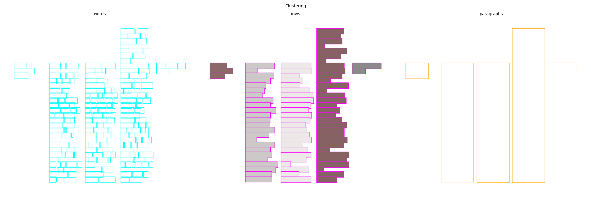
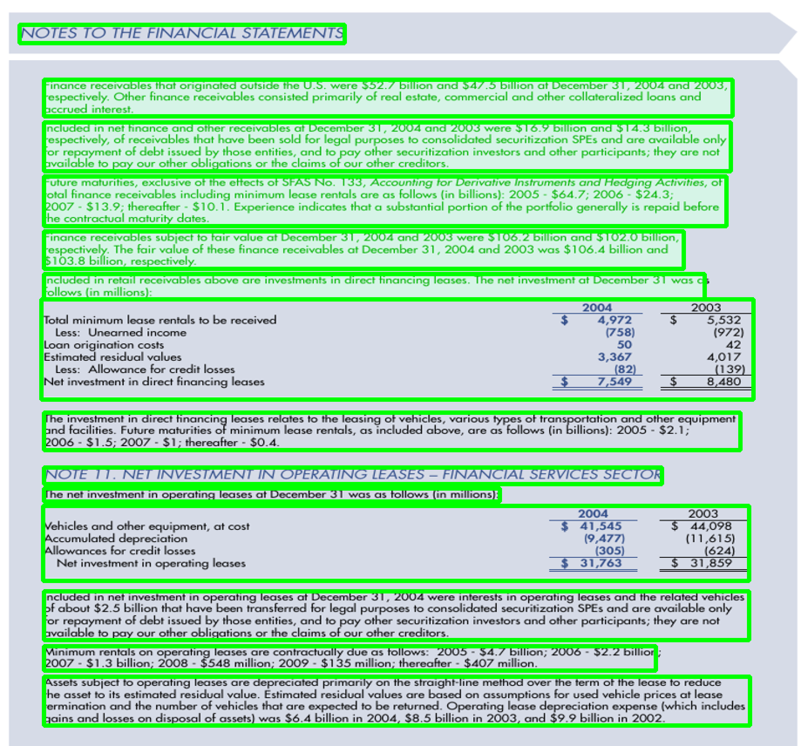

# ReadingBank2Paragraph

This is a byproduct of a university project and the most useable.
The project itself was about document analysis based on a documents' layout. It is separated to the other byproducts in this repository.

## How it works

The [ReadingBank](https://github.com/doc-analysis/ReadingBank) dataset consists of boxes which are representing words.
Those are clustered into lines or rows.
Finally, those rows are clustered again into paragraphs using agglomerative clustering.

In order to find the closest boxes (which representing lines) a customized manhattan-distance based distance is used.
This distance calculates the closest distance between two boxes.
If they overlap in one dimension (x- or y-axis) the distance is 0.

Since multiple lines (horizontally and vertically) can form a single paragraph two thresholds are used.
You can find and change those the [config.py](src/config.py)-file.
Namely, they are ``DISTANCE_THRESHOLD`` and ``CLUSTER_THRESHOLD``.  
While ``DISTANCE_THRESHOLD`` is used as threshold for the distance in x-axis direction, ``CLUSTER_THRESHOLD`` is used for the distance in y-axis direction. 

## How to use this code

### Installation
1. ``pip install -r requirements.txt``
2. ``cd src/``
3. ``python example.py``

### Usage

You can find in [example.py](src/example.py) the intended usage.
The lines in focus are:
```python
clustered_document = process(readingbank_document)
visualize_readingbank_document(
    doc=clustered_document,
    paragraphs_affiliation=clustered_document["paragraph_class_per_line"],
)
```
This produces a plot like this one:


This Repository's intended use is to work with documents which are given in the format of the ReadingBanks format.
This includes (only) the layout information.
If you want to use an arbitrary document, make sure it is a json-object containing the keys: ``src`` and ``tgt``.  
Examples are given in the [example.jsonl](data/example.jsonl)-file.


# Classifier

This is a byproduct of the master project, as well. The idea was to train a classifier to classify layout elements as new feature for the reading order. The relation between layout elements and the reading order is given. For example, a title is normally before a text element and when there is a picture there will be a Caption, as well.

The classifier created in this project isn't perfect and kind of simple. For more information read the report of the project. It can be a startpoint to create an even better classifier to create a strong feature for the overall task - the reading order.

## How to use

The dataset used for the training is given. It's in the "datasets" folder for free use. The model used for training is the XGBoost model, because it's a very strong and simple classifier. Feel free to use different models.

The first script will train the model, will save the model in the "modelle" folder and create a confusion matrix about the model to have a transparency and information. The second file shows the predictions of the model, to get a feeling about the consistency of the model.

It's a good start to dive deeper into this topic and create an even better model to use it later as a feature for the reading order.
For more information, read the report.

### Installation
I personally use Conda for creating my virtual environments. For the Classifier you need Python 3.11 and the following installation steps:
```
conda create --name masterproject python=3.11
conda install -c conda-forge opencv
conda install -c anaconda scikit-learn
conda install -c conda-forge xgboost
conda install -c conda-forge matplotlib
conda install pytorch cpuonly -c pytorch
conda install -c conda-forge pytorch-lightning
conda install -c anaconda nltk
conda install -c conda-forge wandb
conda install -c conda-forge tqdm
```

# Annotator

It's a tool we created to annotate a custom dataset for the Reading Order.
You have to download the Doclaynet dataset first. Afterwards you can click together a reading order and visualize it. It will look like the following example:


DocLayNet:
https://github.com/DS4SD/DocLayNet

## How it works

The Doclaynet dataset consists of boxes around every layout element. It has classes for them but not a reading order to use for the next steps. Therefor the annotator folder can be used to click a custom reading order dataset together, out of the DocLayNet Dataset.

In this folder there is an annotator file for creating the dataset. The paths objects have to be change to the location of the downloaded DocLayNet dataset and then the annotation can be started. With "n" - the next document will load; with "s" the dataset will be saved and with "q" the application will close.

